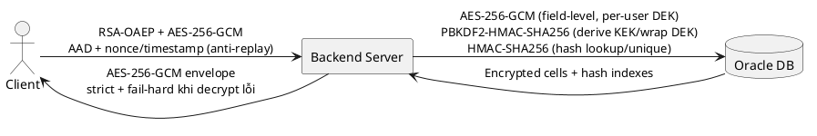
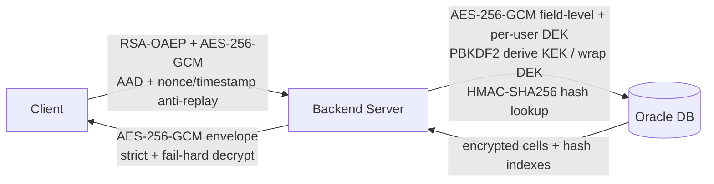

# Sơ đồ kiến trúc bảo mật (ngắn gọn)

Mục tiêu: sơ đồ khái quát luồng Client -> Server -> DB, chỉ nêu thuật toán/cơ chế chính giữa các thành phần.

## PlantUML

## Mermaid

## Gợi ý phần giải thích ngay dưới sơ đồ

- Client <-> Server: hybrid encryption cho transport (RSA-OAEP bọc session key, AES-GCM mã hóa payload).
- Server <-> DB: mã hóa dữ liệu nhạy cảm theo user key; dùng PBKDF2 cho vòng đời key và HMAC cho tra cứu/unique.
- Authorization: JWT + single-session sid + kiểm tra ownership để mỗi user chỉ xem dữ liệu của chính mình.
