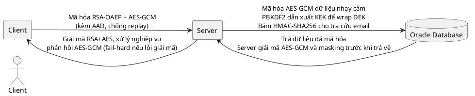

# Security Architecture (Updated)

Sơ đồ ngắn gọn theo luồng bảo mật thực tế của hệ thống.

## PlantUML



## Mermaid

```mermaid
flowchart LR
    C[Client]
    S[Server]
    DB[(Oracle Database)]

    C -->|Mã hóa RSA-OAEP + AES-GCM\n(kèm AAD, chống replay)| S
    S -->|Giải mã RSA+AES, xử lý nghiệp vụ\nPhản hồi AES-GCM| C
    S -->|Mã hóa AES-GCM dữ liệu nhạy cảm\nPBKDF2 dẫn xuất KEK để wrap DEK\nBăm HMAC-SHA256 cho lookup email| DB
    DB -->|Trả dữ liệu đã mã hóa\nServer giải mã AES-GCM + masking| S
```

## Tóm tắt ngắn

- Client -> Server: Mã hóa RSA-OAEP + AES-GCM (AAD, chống replay).
- Server -> DB: Mã hóa AES-GCM cho dữ liệu nhạy cảm; PBKDF2 để dẫn xuất KEK và wrap DEK.
- DB -> Server -> Client: Server giải mã AES-GCM, áp dụng masking, rồi phản hồi dữ liệu bảo vệ bằng AES-GCM.
