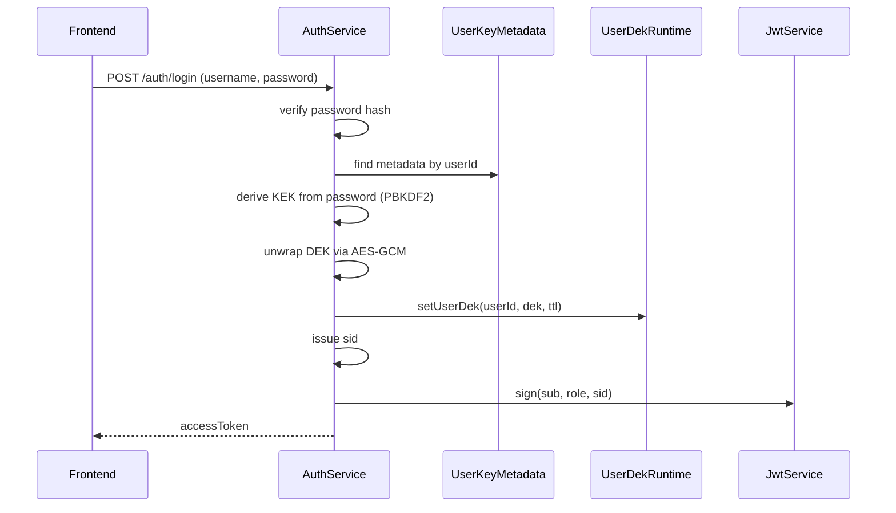
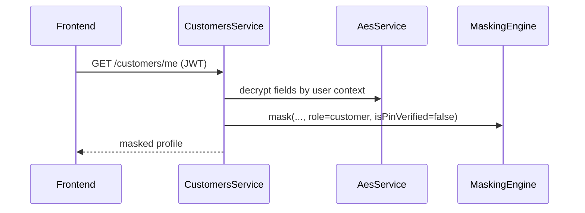
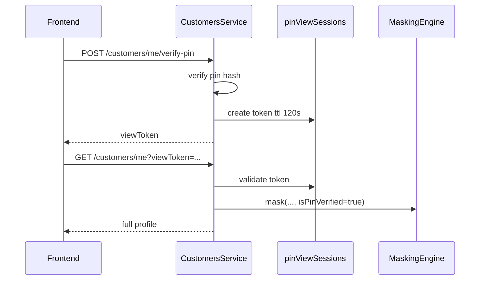

# CSAT Security Deep Dive (Runtime Key, Crypto Flow, JWT, Masking)

## 1) Mục tiêu của tài liệu

Tài liệu này giải thích rất chi tiết cơ chế bảo mật hiện tại của hệ thống CSAT.

Trọng tâm là cách nhiều lớp bảo vệ phối hợp với nhau:

- Lớp truyền tải: RSA-OAEP + AES-256-GCM envelope ở tầng ứng dụng.
- Lớp phiên đăng nhập: JWT + single active session (`sid`).
- Lớp dữ liệu nhạy cảm: AES-256-GCM at-rest với DEK theo người dùng.
- Lớp quản lý khóa: PBKDF2 để tạo KEK, wrapped DEK, recovery wrap.
- Lớp hiển thị: masking theo vai trò và trạng thái PIN.

Các flow được bóc tách:

- Register.
- Login.
- Xem profile trước khi verify PIN.
- Xem profile sau khi verify PIN.
- Tương tác với forgot password và change password để hiểu vòng đời khóa.

Mục tiêu bảo mật nghiệp vụ được diễn giải thành kỹ thuật:

- Chỉ chủ tài khoản mới xem được dữ liệu đầy đủ.
- Admin không thể xem đầy đủ dữ liệu nhạy cảm.
- Dữ liệu nhạy cảm trong DB bị vô nghĩa nếu không có khóa phù hợp.
- Nếu JWT bị lộ, có thể thu hồi bằng cơ chế `sid`.
- Nếu password đổi, DEK vẫn được bảo toàn bằng cơ chế re-wrap.

---

## 2) Bản đồ thành phần liên quan

### 2.1 Backend crypto và auth

- `backend/src/crypto/services/aes.service.ts`
- `backend/src/crypto/services/user-dek-runtime.service.ts`
- `backend/src/crypto/services/user-key-derivation.service.ts`
- `backend/src/crypto/services/user-key-metadata.service.ts`
- `backend/src/crypto/services/rsa-transport.service.ts`
- `backend/src/crypto/interceptors/transport-envelope.interceptor.ts`
- `backend/src/modules/auth/auth.service.ts`
- `backend/src/modules/auth/strategies/jwt.strategy.ts`
- `backend/src/modules/auth/services/session-registry.service.ts`

### 2.2 Backend profile, PIN, masking

- `backend/src/modules/customers/customers.service.ts`
- `backend/src/modules/customers/customers.controller.ts`
- `backend/src/masking/masking.engine.ts`
- `backend/src/common/interceptors/crypto-trace.interceptor.ts`
- `backend/src/crypto/services/crypto-trace-context.service.ts`

### 2.3 Frontend transport và session handling

- `frontend/src/api/transportEnvelope.ts`
- `frontend/src/api/client.ts`
- `frontend/src/contexts/AuthContext.tsx`

### 2.4 Persistence metadata khóa

- `backend/src/modules/auth/entities/user-key-metadata.entity.ts`
- Bảng `USER_KEY_METADATA`.

### 2.5 Dữ liệu email đã nâng cấp

- `backend/src/crypto/services/email-crypto.service.ts`
- `EMAIL_ENCRYPTED`, `EMAIL_HASH` trong `USERS` và `CUSTOMERS`.

---

## 3) Khái niệm cốt lõi: DEK, KEK, wrapped DEK, runtime DEK

### 3.1 DEK là gì trong hệ thống này

DEK (Data Encryption Key) là khóa AES 32-byte dùng để mã hóa dữ liệu nghiệp vụ nhạy cảm.

Ví dụ dữ liệu dùng DEK:

- Số điện thoại.
- CCCD.
- Ngày sinh.
- Địa chỉ.
- Số tài khoản (qua `AccountCryptoService`).
- Số dư.

DEK không phải khóa hệ thống duy nhất cho tất cả user.

Kiến trúc hiện tại đi theo hướng DEK theo user.

### 3.2 KEK là gì

KEK (Key Encryption Key) là khóa trung gian để bọc DEK.

KEK không lưu trực tiếp trong DB.

KEK được dẫn xuất từ password bằng PBKDF2-SHA256.

Tham số PBKDF2 lấy từ metadata:

- `kdfSaltHex`.
- `kdfIterations` (mặc định thiết kế 310000).
- `dkLen = 32`.

### 3.3 Wrapped DEK

DEK gốc được mã hóa bằng KEK rồi lưu vào `WRAPPED_DEK_B64`.

Dạng lưu là JSON string chứa:

- `iv`.
- `tag`.
- `payload`.

Thuật toán wrap dùng AES-GCM.

Hệ quả:

- DB chỉ chứa wrapped blob, không chứa DEK thô.
- Muốn lấy DEK phải có password đúng để tạo KEK đúng.

### 3.4 Recovery wrapped DEK

Nếu cấu hình `DEK_RECOVERY_KEY`, DEK còn được bọc lần hai.

Bản bọc này lưu tại `RECOVERY_WRAPPED_DEK_B64`.

Dùng trong forgot password để re-wrap theo password mới mà không mất dữ liệu.

### 3.5 Runtime DEK là gì

Runtime DEK là DEK đã giải bọc thành công và giữ tạm trong RAM.

Lưu trong `UserDekRuntimeService` dưới dạng `Map<userId, { dek, expiresAt }>`.

TTL mặc định 8 giờ.

Khi lấy ra service trả bản copy `Buffer.from(...)`, không trả reference gốc.

---

## 4) Vì sao `userDEK runtime` phải cache key material trong RAM

Đây là điểm bạn hỏi trọng tâm.

Câu trả lời là: cache runtime DEK là cân bằng giữa bảo mật, hiệu năng, và tính đúng nghiệp vụ.

### 4.1 Lý do hiệu năng

Nếu không cache:

- Mỗi lần decrypt một field phải derive KEK từ password.
- PBKDF2 310000 vòng là cố ý chậm để chống brute-force.
- Dữ liệu profile có nhiều cột mã hóa, gây độ trễ lớn.

Ví dụ một request profile có thể cần decrypt 4-6 trường.

Nếu mỗi trường đều phải unwrap DEK lại từ password thì latency tăng mạnh.

Cache runtime DEK giúp:

- Unwrap một lần sau login.
- Dùng lại trong phiên cho nhiều thao tác.

### 4.2 Lý do kiến trúc API

Nhiều API decrypt dữ liệu không nhận password người dùng ở payload.

Ví dụ:

- `GET /customers/me`.
- `GET /accounts/me`.
- `GET /cards`.

Các API này dựa vào JWT đã đăng nhập, không nên buộc nhập lại password mỗi request.

Vì vậy cần nơi lưu DEK tạm theo user trong runtime.

### 4.3 Lý do tách trách nhiệm

Tầng auth chịu trách nhiệm xác thực password tại login.

Tầng nghiệp vụ profile/accounts chịu trách nhiệm đọc dữ liệu.

Runtime cache là cầu nối giữa hai tầng:

- Auth xác thực password xong mở DEK.
- Dịch vụ dữ liệu dùng DEK đã mở để decrypt.

### 4.4 Lý do tương thích migration

`AesService.decryptForUser` có fallback key cũ (`masterKey`) cho dữ liệu legacy.

Trong giai đoạn chuyển đổi, cache DEK giúp:

- Ưu tiên decrypt bằng user DEK.
- Nếu fail mới fallback legacy.

Không cache sẽ khiến logic migration vừa nặng vừa dễ lỗi timeout.

### 4.5 Rủi ro của cache và cách giảm thiểu

Có rủi ro vì key material tồn tại trong RAM.

Biện pháp giảm thiểu hiện có:

- TTL tự hết hạn.
- `clearUserDek(userId)` khi logout/change-password/forgot-password-confirm.
- Trả bản copy buffer thay vì reference.
- Session `sid` bị revoke thì request mới bị từ chối.

Biện pháp có thể nâng cấp thêm:

- Gắn DEK theo `sid` thay vì chỉ `userId`.
- Zeroize buffer khi clear (best effort).
- Dùng store ngoài tiến trình nếu scale đa instance.

Kết luận:

Cache runtime DEK là cần thiết để hệ thống vận hành mượt và đúng UX.

Không cache sẽ làm cơ chế per-user encryption gần như không dùng được ở môi trường thực tế.

---

## 5) Cách DEK được chọn trong `AesService`

### 5.1 Quy tắc chọn key khi encrypt

`encrypt(plaintext)`:

- Nếu `CryptoTraceContext` có `userId` thì gọi `encryptForUser(userId, plaintext)`.
- Nếu không có `userId` thì dùng `masterKey`.

`encryptForUser`:

- `resolveKeyForUser(userId)`.
- Nếu runtime có DEK thì dùng DEK.
- Nếu chưa có DEK thì fallback `masterKey`.

### 5.2 Quy tắc chọn key khi decrypt

`decrypt(cell)`:

- Nếu trace có `userId` thì `decryptForUser`.
- Không có thì dùng `masterKey`.

`decryptForUser(userId, cell)`:

- Lấy DEK runtime.
- Nếu không có DEK runtime: decrypt bằng `masterKey` (legacy path).
- Nếu có DEK: thử DEK trước.
- Nếu DEK fail auth tag: fallback `masterKey` (migration fallback).

### 5.3 Ý nghĩa bảo mật của fallback

Fallback không phải để bỏ qua bảo mật.

Fallback nhằm đọc dữ liệu cũ đã mã hóa bằng key toàn cục trước đây.

Nếu không có fallback thì migration cũ sang mới sẽ vỡ.

Nhưng cần quản trị chặt:

- Chỉ giữ fallback trong giai đoạn chuyển đổi.
- Theo dõi tỷ lệ decrypt fallback bằng log/metric.
- Khi backfill đủ thì tắt fallback để tăng độ cứng.

---

## 6) Vai trò của `CryptoTraceContext` trong chọn user key

### 6.1 Tại sao cần context theo request

`AesService` không nhận `userId` ở mọi call-site.

Do đó hệ thống dùng `AsyncLocalStorage` để truyền context ngầm theo request.

`CryptoTraceInterceptor` thiết lập:

- `actionId`.
- `actionName`.
- `userId` từ JWT (`req.user.sub`) hoặc `anonymous`.

Các service gọi `aes.encrypt/decrypt` phía dưới vẫn lấy được `userId` hiện hành.

### 6.2 Lợi ích

- Giảm truyền tham số lặp lại qua nhiều tầng hàm.
- Tránh lỗi quên truyền userId.
- Giữ được audit trace nhất quán.

### 6.3 Rủi ro cần lưu ý

- Async context cần được giữ xuyên suốt chain RxJS/Promise.
- Nếu có code chạy ngoài request scope (cron, queue) thì không có context.
- Khi đó `AesService` sẽ fallback key mặc định.

Cần tách rõ đường xử lý background để tránh decrypt sai key.

---

## 7) Flow Register chi tiết (từ input đến dữ liệu lưu)

### 7.1 Validation và uniqueness

Ở `AuthService.register` hệ thống chuẩn hóa email:

- `normalizeEmail` -> lowercase + trim.

Sinh `emailHash` bằng HMAC-SHA256 (`EmailCryptoService.hashEmail`).

Kiểm tra trùng:

- `username`.
- `emailHash` mới.
- `LOWER(email)` legacy để tương thích dữ liệu cũ.

### 7.2 Dữ liệu nhạy cảm phi-email

Phone/CCCD uniqueness cần decrypt dữ liệu hiện có của customer cũ để so sánh.

Đây là điểm tốn chi phí nhưng đảm bảo tính đúng trên dữ liệu encrypted.

### 7.3 Tạo user + password hash

`passwordHash = pbkdf2.hashSecret(password, 'password')`.

User được tạo với lock counters mặc định 0.

Email được lưu 3 dạng cho mục tiêu khác nhau:

- `email` plaintext normalized (legacy compatibility).
- `emailEncrypted` (AES-GCM blob).
- `emailHash` (lookup index).

### 7.4 Khởi tạo DEK mới cho user

`initializeFreshUserDek(userId, password, 'active')`:

- Sinh DEK random 32 bytes.
- Sinh salt mới.
- Derive KEK từ password + salt + iterations.
- Wrap DEK bằng KEK -> `wrappedDekB64`.
- Optional wrap bằng recovery key -> `recoveryWrappedDekB64`.
- Upsert vào `USER_KEY_METADATA`.
- Nạp DEK vào runtime cache.

### 7.5 Mã hóa customer profile

Các trường profile nhạy cảm được encrypt theo user:

- `phone`.
- `cccd`.
- `dateOfBirth` (normalize trước).
- `address`.

### 7.6 Mã hóa account

Số tài khoản:

- Hash để uniqueness.
- Encrypt bằng key theo user.

Balance ban đầu (`0`) cũng được encrypt.

### 7.7 Audit và phản hồi

Ghi audit `REGISTER`.

Trả về message thành công.

### 7.8 Ý nghĩa an toàn tổng hợp của Register

Sau register xong:

- Password không lưu plaintext.
- DEK không lưu plaintext ở DB.
- Dữ liệu nhạy cảm lưu ciphertext + IV + tag.
- Lookup email không cần plaintext query nhờ hash.

---

## 8) Flow Login chi tiết (password, lock policy, DEK runtime, JWT sid)

### 8.1 Kiểm tra user và password

- Tìm theo username.
- Nếu user tồn tại, verify password hash.
- Nếu sai: trả thông điệp chung chống enumeration.

### 8.2 Chính sách khóa do sai mật khẩu

Mỗi lần sai password:

- Tăng `passwordFailedAttempts`.
- Đến ngưỡng 5:
  - `passwordLocked = 1`.
  - `passwordLockedAt = now`.
  - `isActive = 0`.
  - `lockReason = 'WRONG_PASSWORD'`.

### 8.3 Nếu đúng password nhưng tài khoản bị khóa

Trả message theo ngữ cảnh lock reason:

- Bị khóa do PIN.
- Bị khóa do password.
- Bị khóa do OTP forgot-password.

### 8.4 Reset counter khi login thành công

Nếu trước đó có fail count, reset về 0.

### 8.5 Nạp DEK runtime khi role customer

`ensureUserDekRuntime(user.id, dto.password)`:

- Đọc metadata.
- Nếu chưa có metadata -> init fresh DEK (`legacy` state).
- Nếu có metadata -> unwrap bằng password.
- Nếu unwrap thất bại -> fallback khởi tạo fresh DEK (trường hợp metadata cũ hỏng/không khớp).
- Set DEK vào runtime cache.

### 8.6 Cấp `sid` và JWT

`sid = sessionRegistry.issueSession(user.id)`.

JWT chứa:

- `sub`.
- `username`.
- `role`.
- `sid`.

Điều này biến JWT thành "stateless token + stateful revocation checkpoint".

### 8.7 Ý nghĩa bảo mật của `sid`

Nếu chỉ JWT thuần stateless:

- Không thể revoke token đã phát cho đến khi hết hạn.

Với `sid`:

- Server lưu `activeSessions[userId] = sid`.
- Request nào có JWT sid khác sẽ bị từ chối `SESSION_REVOKED`.

### 8.8 Tương tác frontend khi bị revoke

`frontend/src/api/client.ts`:

- Nếu 401 + message `SESSION_REVOKED`.
- Xóa sessionStorage auth.
- Redirect `/login?reason=session-revoked`.

---

## 9) Flow kiểm tra JWT + single active session

### 9.1 JwtStrategy.validate

Mỗi request guard qua JWT strategy:

- Decode payload.
- Nếu `SINGLE_SESSION_ENABLED !== 'false'` thì kiểm tra `sessionRegistry.isSessionActive(payload.sub, payload.sid)`.
- Nếu false -> throw `UnauthorizedException('SESSION_REVOKED')`.

### 9.2 Tác động nghiệp vụ

- Login mới của cùng user sẽ đè session cũ.
- Token cũ bị vô hiệu ngay lập tức.
- Giảm nguy cơ chia sẻ token đa thiết bị ngoài chính sách.

### 9.3 Điểm cần hiểu đúng

Session registry hiện tại là in-memory.

Nghĩa là:

- Restart server: map mất.
- Multi-instance: mỗi instance có map riêng.

Đây là trade-off đã chấp nhận theo quyết định hiện tại.

---

## 10) Flow Logout và xóa runtime key

### 10.1 Logout hiện tại

`AuthService.logout`:

- `invalidateSession(userId)`.
- Audit log `LOGOUT`.

### 10.2 Xóa DEK runtime

DEK runtime hiện được clear mạnh trong các flow:

- `confirmForgotPassword`.
- `changePassword`.

Có thể cân nhắc clear thêm ở `logout` để giảm thời gian sống của key trong RAM.

### 10.3 Frontend logout

`AuthContext.logout`:

- Gọi `/auth/logout`.
- Dù backend lỗi vẫn dọn local auth.
- Điều hướng về login.

---

## 11) Flow Profile trước PIN (owner nhưng chưa verify PIN)

### 11.1 Endpoint

- `GET /customers/me`.

Yêu cầu:

- JWT hợp lệ.
- Role customer.

### 11.2 Lấy dữ liệu

`CustomersService.getProfile` xác định owner:

- `isOwner = viewerRole === CUSTOMER && customer.userId === viewerId`.

Nếu owner thì decrypt các trường encrypted.

### 11.3 Trạng thái PIN view

`pinMode = isOwner && isPinViewSessionValid(viewerId, viewToken)`.

Nếu chưa verify PIN thì `pinMode = false`.

### 11.4 Áp dụng masking

Dù owner, trước PIN vẫn đi qua masking ở mode customer chưa verify.

Kết quả điển hình:

- Email bị che cục bộ.
- Phone/CCCD bị che giữa.
- Address và DOB theo chính sách hiện hành.
- `isPinVerified = false`.

### 11.5 Ý nghĩa

JWT chỉ chứng minh "đúng account".

PIN verification chứng minh thêm "đúng người đang thao tác tại thời điểm truy cập dữ liệu full".

Đây là lớp step-up auth cho dữ liệu cực nhạy cảm.

---

## 12) Flow Verify PIN và tạo view token

### 12.1 Endpoint

- `POST /customers/me/verify-pin`.

### 12.2 Kiểm tra lock và pin hash

Nếu account locked hoặc pinLocked -> chặn ngay.

Nếu pin sai:

- Tăng `pinFailedAttempts`.
- Đến 5 thì:
  - `pinLocked = 1`.
  - `pinLockedAt = now`.
  - `user.isActive = 0`.
  - `user.lockReason = 'PIN_ATTEMPT'`.

### 12.3 Khi PIN đúng

- Reset counter lock PIN nếu trước đó có lỗi.
- Audit `PIN_VERIFY_SUCCESS`.
- Tạo pin-view session 2 phút:
  - `token = randomUUID`.
  - `expiresAt = now + 120s`.
  - Lưu map `pinViewSessions[userId]`.

Trả về:

- `viewToken`.
- `expiresAt`.
- `ttlSeconds`.

### 12.4 Vì sao tách `viewToken` khỏi JWT

JWT thường có hạn dài hơn 2 phút.

Nếu encode trạng thái PIN vào JWT sẽ khó quản lý TTL ngắn.

Map runtime 2 phút giúp:

- Step-up ngắn hạn.
- Tự hết hạn nhanh.
- Không phải phát JWT mới cho mỗi verify PIN.

---

## 13) Flow Profile sau PIN (full reveal cho owner)

### 13.1 Cách gọi

Frontend thêm `viewToken` vào query khi gọi profile/update.

### 13.2 Validation token

`isPinViewSessionValid(userId, token)` kiểm tra:

- Có token.
- Token khớp map.
- Chưa quá hạn.

### 13.3 Hiển thị dữ liệu

`MaskingEngine.mask(..., role=CUSTOMER, isPinVerified=true)` trả raw value.

Nghĩa là owner sau verify PIN được thấy full.

### 13.4 Cập nhật hồ sơ

`PUT /customers/me` yêu cầu token hợp lệ.

Nếu thiếu hoặc hết hạn -> `Forbidden`.

Điều này ngăn cập nhật dữ liệu nhạy cảm chỉ bằng JWT đơn thuần.

---

## 14) Phân tích sâu `MaskingEngine`: cần hay không cần

### 14.1 Vì sao vẫn cần masking dù đã mã hóa at-rest

Mã hóa at-rest bảo vệ dữ liệu khi nằm trong DB/storage.

Masking bảo vệ dữ liệu khi đã giải mã ở lớp ứng dụng và chuẩn bị trả ra UI/log.

Hai lớp này giải quyết hai giai đoạn rủi ro khác nhau.

Không thể thay thế nhau.

### 14.2 Trường hợp rủi ro nếu không masking

- Admin API lộ full PII.
- Lỗi FE hiển thị quá mức thông tin.
- Log debug vô tình chứa raw field.
- Screenshot/UI shoulder-surfing.

### 14.3 Mức bảo vệ hiện tại của masking

Bảo vệ tốt ở lớp trình bày dữ liệu trả về client.

Không bảo vệ được khi:

- Service nội bộ đã lấy được raw trước masking.
- Kẻ tấn công có RCE trong app process.
- Kẻ tấn công đọc RAM trực tiếp.

### 14.4 Kết luận về necessity

Masking là bắt buộc cho yêu cầu "admin không xem full".

Nếu bỏ masking, chỉ cần một endpoint decrypt là mục tiêu nghiệp vụ bị phá.

### 14.5 Kết luận về sufficiency

Masking một mình không đủ.

Cần đi cùng:

- Ownership checks.
- PIN step-up.
- Role guards.
- Audit logs.
- Data encryption at-rest.

---

## 15) Phối hợp RSA, AES-GCM, PBKDF2, JWT theo từng lớp

### 15.1 PBKDF2 ở đâu

PBKDF2 dùng cho:

- Hash password/PIN (theo service nội bộ).
- Derive KEK từ password để wrap/unwrap DEK.

PBKDF2 không dùng cho transport.

### 15.2 AES-GCM ở đâu

AES-GCM dùng ở 3 nơi:

1. Mã hóa dữ liệu cột nhạy cảm (at-rest).
2. Bọc DEK bằng KEK và recovery key (key wrapping theo JSON envelope).
3. Mã hóa payload app-layer transport (session key do RSA bảo vệ).

### 15.3 RSA ở đâu

RSA-OAEP dùng để mã hóa AES session key cho mỗi request envelope.

RSA không dùng để mã hóa payload trực tiếp.

### 15.4 JWT ở đâu

JWT dùng xác thực danh tính và vai trò cho API.

JWT không chứa dữ liệu nhạy cảm profile.

JWT + `sid` dùng điều khiển vòng đời session.

### 15.5 Chuỗi phối hợp end-to-end

- User login bằng password.
- Server verify password, unwrap DEK và cache runtime.
- Server phát JWT có `sid`.
- Frontend dùng JWT gọi API.
- Nếu bật strict transport, frontend mã hóa body bằng AES session key.
- AES session key được RSA encrypt trước khi gửi.
- Backend decrypt session key bằng private key.
- Backend decrypt body envelope.
- Business logic chạy, dùng DEK runtime để decrypt at-rest khi cần.
- Data trước khi trả client đi qua masking.
- Response được AES encrypt lại ở transport envelope.

---

## 16) App-layer transport envelope chi tiết

### 16.1 Frontend bootstrap public key

Frontend gọi `/api/transport/public-key` để lấy:

- `kid`.
- `n`.
- `e`.
- `alg`.

Cache metadata ngắn hạn (`META_TTL_MS`).

### 16.2 Header bắt buộc cho request envelope

- `X-App-Envelope: 1`
- `X-App-Timestamp`
- `X-App-Nonce`
- `X-App-Session-Key` (RSA encrypted AES key)

### 16.3 AAD binding

AAD được xây theo:

`METHOD|PATH|TIMESTAMP|NONCE`

Cả frontend và backend phải khớp đúng AAD.

Nếu lệch sẽ fail xác thực GCM hoặc bị chặn `AAD không khớp`.

### 16.4 Replay protection

Backend kiểm tra:

- Timestamp trong cửa sổ lệch cho phép (`APP_LAYER_CRYPTO_MAX_SKEW_MS`).
- Nonce + timestamp chưa từng dùng trong replay cache.

Replay cache là map in-memory có expiry.

### 16.5 Strict mode

Nếu strict bật:

- Request không envelope (trừ một số path bypass) bị chặn.
- Frontend không thiết lập được envelope thì tự chặn request.

### 16.6 Lợi ích của app-layer transport

Ngay cả khi TLS terminate ở proxy trung gian, payload API vẫn là ciphertext app-level.

Giảm rủi ro lộ payload trong một số mô hình hạ tầng phức tạp.

---

## 17) Vì sao RSA vẫn quan trọng dù đã có HTTPS

### 17.1 HTTPS và app-layer giải bài toán khác nhau

HTTPS bảo vệ kênh transport socket-level giữa hai điểm TLS.

RSA envelope bảo vệ payload ở tầng ứng dụng với metadata ràng buộc request.

### 17.2 Khi nào RSA envelope tăng giá trị rõ rệt

- Có reverse proxy hoặc thiết bị quan sát nội bộ.
- Muốn defense-in-depth.
- Muốn anti-replay gắn chặt nghiệp vụ API.

### 17.3 Giới hạn cần hiểu

Nếu app server bị compromise hoàn toàn thì private key và plaintext đều có thể lộ.

Vì vậy RSA envelope không thay thế hardening máy chủ.

---

## 18) Forgot Password, Recovery Wrap và không mất dữ liệu

### 18.1 Vấn đề cốt lõi

Nếu chỉ bọc DEK bằng KEK từ password cũ:

- Quên password thì không mở DEK.
- Đổi password sẽ mất khả năng giải mã dữ liệu cũ.

### 18.2 Cơ chế hiện tại

- Lưu thêm `recoveryWrappedDekB64` khi có recovery key.
- Flow forgot-password sau OTP đúng:
  - Unwrap DEK bằng recovery key.
  - Re-wrap DEK bằng KEK từ password mới.

### 18.3 Hệ quả

- User đổi password qua OTP mà dữ liệu encrypted vẫn đọc được.
- Không cần re-encrypt toàn bộ dữ liệu profile.

### 18.4 Trường hợp không có recovery key

Code có fallback:

- Audit sự kiện fallback.
- Khởi tạo DEK mới.

Điều này giữ hệ thống sống nhưng có thể làm mất khả năng đọc dữ liệu cũ đã mã hóa key cũ.

---

## 19) Change Password và re-wrap chuẩn

### 19.1 Flow chuẩn

`changePassword(userId, currentPassword, newPassword)`:

- Verify current password.
- Chống đặt lại giống mật khẩu cũ.
- `rewrapUserDek` từ password cũ sang mới.
- Cập nhật password hash.
- Invalidate session + clear runtime DEK.

### 19.2 Vì sao phải invalidate session

Sau đổi mật khẩu, mọi token cũ phải vô hiệu.

Tránh trường hợp thiết bị cũ tiếp tục hoạt động với credential cũ.

### 19.3 Vì sao clear runtime DEK

Giảm thời gian khóa tồn tại trong RAM sau khi credential thay đổi.

Buộc vòng đăng nhập mới để nạp lại DEK dưới session mới.

---

## 20) Email encryption + hash: vai trò kép

### 20.1 `emailHash` để tra cứu

Dùng HMAC-SHA256 để:

- Tìm kiếm nhanh.
- Check uniqueness.
- Không cần query theo plaintext.

### 20.2 `emailEncrypted` để bảo mật at-rest

Email vẫn là PII nên cần mã hóa lưu trữ.

### 20.3 Trường `email` plaintext legacy

Hiện còn để tương thích và rollback an toàn.

Lộ trình cứng hơn:

- Backfill đủ.
- Chuyển logic đọc sang encrypted-only.
- Giảm/loại bỏ phụ thuộc plaintext column.

---

## 21) Security boundary: lớp nào bảo vệ cái gì

### 21.1 Bảng phân ranh giới

- PBKDF2:
  - Bảo vệ chống brute-force mật khẩu offline tốt hơn hash nhanh.
  - Không bảo vệ transport.

- Wrapped DEK:
  - Bảo vệ khóa dữ liệu khi nằm ở DB.
  - Không chống runtime compromise.

- Runtime DEK cache:
  - Tối ưu hiệu năng, không phải lớp bảo vệ chính.
  - Cần TTL + clear đúng lúc.

- AES at-rest:
  - Bảo vệ dữ liệu ở storage.
  - Không kiểm soát ai được API trả dữ liệu.

- JWT + sid:
  - Xác thực và revoke session.
  - Không tự che dữ liệu nếu endpoint trả sai.

- PIN step-up:
  - Nâng mức xác thực cho hành vi nhạy cảm.
  - Không thay thế password auth ban đầu.

- Masking:
  - Giới hạn thông tin hiển thị theo role/trạng thái.
  - Không mã hóa dữ liệu ở DB.

- RSA envelope:
  - Bảo vệ payload tầng app + anti-replay.
  - Không thay TLS, không cứu được host compromise.

### 21.2 Ý nghĩa thực tiễn

Không lớp nào đủ một mình.

Sức mạnh đến từ việc xếp chồng đúng thứ tự và đúng điểm chạm dữ liệu.

---

## 22) Threat modeling ngắn gọn theo kịch bản

### 22.1 Kịch bản: lộ dump DB

Kẻ tấn công thấy:

- Password hash.
- Ciphertext profile.
- Wrapped DEK.

Kẻ tấn công không dễ khôi phục plaintext ngay vì cần password đúng để derive KEK.

### 22.2 Kịch bản: lộ JWT cũ sau khi user đăng nhập nơi khác

Nhờ `sid`, token cũ bị revoke khi login mới.

### 22.3 Kịch bản: admin cố xem full PII

`getCustomerById` cho admin đang bị chặn theo policy.

Dữ liệu trả về cho admin ở các điểm khác đi qua masking mạnh hơn owner.

### 22.4 Kịch bản: replay request transport

Nonce + timestamp + replay cache chặn request lặp trong cửa sổ thời gian.

### 22.5 Kịch bản: brute-force PIN

Sai 5 lần khóa account theo lock policy.

---

## 23) Điểm mạnh hiện tại

- Có per-user DEK runtime path.
- Có metadata KDF và wrap rõ ràng.
- Có forgot-password recovery wrap path.
- Có single active session bằng `sid`.
- Có step-up PIN view token TTL ngắn.
- Có masking engine tách bạch role.
- Có app-layer transport encryption + anti-replay.

---

## 24) Điểm cần nâng cấp tiếp

- SessionRegistry đang in-memory, nên đưa Redis để hỗ trợ multi-instance.
- Gắn runtime DEK theo `userId:sid` để ràng buộc chặt session.
- Clear runtime DEK ngay tại logout để giảm exposure RAM.
- Đánh metric tỷ lệ fallback decrypt bằng master key.
- Sau migration ổn định, giảm dần phụ thuộc plaintext email.
- Tăng kiểm soát secret management (không hardcode/lộ `.env`).
- Bổ sung rate-limit riêng cho verify-pin và OTP confirm theo IP + account.

---

## 25) Sequence minh họa (rút gọn)

### 25.1 Login + nạp DEK

### 25.2 Profile trước PIN

### 25.3 Verify PIN và xem full

---

## 26) Trả lời trực tiếp câu hỏi "userDEK runtime có lưu key material, có nguy hiểm không?"

Có, runtime cache lưu key material trong RAM.

Điều này là chủ đích thiết kế, không phải lỗi.

Mức nguy hiểm:

- Chấp nhận được trong mô hình backend tin cậy, có hardening chuẩn.
- Tăng nếu host/process bị compromise.

Lợi ích đạt được:

- Hiệu năng tốt.
- UX tốt (không yêu cầu nhập lại password mỗi request).
- Tách bạch auth và data access hợp lý.

Điều kiện để an toàn hơn:

- TTL hợp lý.
- Xóa key khi logout/password đổi.
- Session revocation chắc chắn.
- Bảo vệ host runtime và secret store.

Kết luận kỹ thuật:

Nếu mục tiêu là hệ thống ngân hàng thực dụng, runtime key cache là thiết kế hợp lý khi đi kèm các guardrail như hiện tại.

---

## 27) Checklist kiểm thử bảo mật nên chạy định kỳ

### 27.1 Login và session

- Login lần 1 lấy token A.
- Login lần 2 lấy token B.
- Dùng token A gọi API phải nhận `SESSION_REVOKED`.
- Dùng token B phải thành công.

### 27.2 Password lock

- Sai password 5 lần -> account lock.
- Đúng password sau khi lock -> bị chặn với message lock.

### 27.3 PIN lock

- Verify PIN sai 5 lần -> `pinLocked=1`, `user.isActive=0`.
- Sau unlock admin, verify PIN đúng hoạt động lại.

### 27.4 Profile masking

- Chưa verify PIN: trường nhạy cảm bị che.
- Verify PIN xong trong 120s: thấy full.
- Quá 120s: quay lại masked.

### 27.5 Forgot password

- OTP sai nhiều lần -> tăng fail counter.
- OTP đúng + password mới -> đăng nhập lại đọc được dữ liệu cũ.

### 27.6 Transport envelope

- Thiếu header envelope trong strict -> bị chặn.
- Timestamp quá lệch -> bị chặn.
- Replay cùng nonce/timestamp -> bị chặn.
- AAD sai -> decrypt fail.

---

## 28) Tổng kết kiến trúc theo nguyên tắc Defense in Depth

Hệ thống hiện tại không đặt niềm tin vào một lớp duy nhất.

Mỗi lớp chặn một dạng rủi ro:

- PBKDF2 + wrapped DEK: bảo vệ khóa khi lưu trữ.
- AES at-rest: bảo vệ dữ liệu cột nhạy cảm.
- JWT + sid: bảo vệ vòng đời phiên.
- PIN step-up: bảo vệ hành vi xem/cập nhật cực nhạy cảm.
- Masking: bảo vệ mức hiển thị theo vai trò.
- RSA envelope + AAD + nonce/timestamp: bảo vệ payload tầng ứng dụng và chống replay.

Quan trọng nhất về tư duy:

- Không hỏi "lớp nào mạnh nhất".
- Phải hỏi "lớp nào đang bảo vệ rủi ro nào, tại điểm nào trong chuỗi xử lý".

Trong CSAT, câu trả lời đã khá rõ ràng và nhất quán với code hiện tại.

---

## 29) Phụ lục: diễn giải nhanh theo từng câu hỏi thường gặp

### 29.1 Nếu đã có JWT, cần PIN làm gì?

JWT chứng minh đã đăng nhập.

PIN là step-up auth để mở khóa hiển thị/cập nhật dữ liệu profile nhạy cảm.

### 29.2 Nếu đã mã hóa DB, cần masking làm gì?

Mã hóa DB bảo vệ dữ liệu khi lưu.

Masking bảo vệ dữ liệu khi trả ra giao diện/API.

### 29.3 Nếu đã có HTTPS, cần RSA envelope làm gì?

RSA envelope là lớp ứng dụng bổ sung:

- payload ciphertext end-to-end app layer.
- gắn AAD với method/path/time/nonce.
- chống replay ở nghiệp vụ API.

### 29.4 Tại sao không dùng một master key duy nhất cho mọi user?

Master key global tạo blast radius lớn.

Per-user DEK giúp khoanh vùng rủi ro theo tài khoản.

### 29.5 Tại sao còn giữ fallback legacy key?

Để không làm gãy dữ liệu cũ trong giai đoạn migration.

Mục tiêu dài hạn là giảm dần rồi loại bỏ fallback.

---

## 30) Kết luận cuối cùng

Thiết kế hiện tại đã có nền tảng đúng cho hệ thống tài chính cấp ứng dụng:

- Có key hierarchy thực dụng (password -> KEK -> DEK -> data).
- Có runtime key strategy để vận hành thực tế.
- Có session control để revoke tức thời.
- Có step-up PIN cho profile data.
- Có masking để thực thi policy "admin không xem full".
- Có app-layer encrypted envelope để tăng chiều sâu bảo vệ truyền tải.

Điểm mấu chốt khi vận hành production là kỷ luật kỹ thuật:

- quản trị secrets,
- giám sát fallback,
- chuẩn hóa quy trình unlock,
- kiểm thử bảo mật định kỳ,
- và nâng cấp state store cho session/runtime khi scale.

Nếu giữ được kỷ luật đó, kiến trúc này đủ vững để đáp ứng mục tiêu bảo mật nghiệp vụ bạn đang đặt ra.

---

## 31) Ma trận kiểm soát theo điểm chạm dữ liệu

### 31.1 Điểm chạm: nhận request từ client

Kiểm soát áp dụng:

- JWT guard.
- Session `sid` validation.
- Transport envelope validation (khi bật).

Rủi ro giảm được:

- Token cũ sau revoke.
- Replay request trong khoảng thời gian ngắn.
- Payload plaintext khi strict mode bật.

Rủi ro còn lại:

- Token bị lộ và vẫn còn active.
- Client bị chiếm quyền điều khiển.

### 31.2 Điểm chạm: giải mã payload request

Kiểm soát áp dụng:

- RSA private key cho session key.
- AES-GCM tag verification.
- AAD check ràng buộc method/path/timestamp/nonce.

Rủi ro giảm được:

- Payload bị sửa giữa đường.
- Nhầm route nhưng tái sử dụng payload cũ.

Rủi ro còn lại:

- App host compromise.

### 31.3 Điểm chạm: truy cập DB và giải mã at-rest

Kiểm soát áp dụng:

- Per-user runtime DEK.
- Fallback legacy có kiểm soát.
- Ownership checks trước khi trả dữ liệu.

Rủi ro giảm được:

- Lộ ciphertext ở DB không đủ để đọc plaintext.
- User A đọc dữ liệu user B qua endpoint owner-scoped.

Rủi ro còn lại:

- Bug logic nghiệp vụ nếu thiếu where condition đúng.

### 31.4 Điểm chạm: trả response ra client

Kiểm soát áp dụng:

- Masking engine.
- PIN view token trạng thái ngắn hạn.
- Envelope mã hóa response khi bật transport layer.

Rủi ro giảm được:

- Lộ full PII trên UI ngoài policy.
- Lộ response plaintext trên đường app-layer nếu có mắt xích trung gian.

Rủi ro còn lại:

- Người dùng hợp lệ tự lộ dữ liệu trên thiết bị của họ.

---

## 32) Bản đồ trạng thái tài khoản và khóa

### 32.1 Trạng thái khóa theo password

Biến liên quan:

- `passwordFailedAttempts`.
- `passwordLocked`.
- `passwordLockedAt`.
- `isActive`.
- `lockReason = WRONG_PASSWORD`.

Ngưỡng:

- 5 lần sai -> khóa.

### 32.2 Trạng thái khóa theo forgot OTP

Biến liên quan:

- `forgotOtpFailedAttempts`.
- `passwordLocked`.
- `isActive`.
- `lockReason = FORGOT_OTP_ATTEMPT`.

Ngưỡng:

- 5 lần sai -> khóa.

### 32.3 Trạng thái khóa theo PIN

Biến liên quan ở `CUSTOMERS`:

- `pinFailedAttempts`.
- `pinLocked`.
- `pinLockedAt`.

Biến liên quan ở `USERS`:

- `isActive`.
- `lockReason = PIN_ATTEMPT`.

Ngưỡng:

- 5 lần sai -> khóa.

### 32.4 Ý nghĩa thiết kế lockReason

Giúp hệ thống:

- Trả thông báo nghiệp vụ đúng ngữ cảnh.
- Phân tích audit nguyên nhân khóa.
- Hỗ trợ dashboard vận hành bảo mật.

---

## 33) Ma trận dữ liệu nào được mã hóa, dữ liệu nào được hash

### 33.1 Dữ liệu mã hóa

- `phone`.
- `cccd`.
- `dateOfBirth`.
- `address`.
- `accountNumber`.
- `balance`.
- `emailEncrypted`.

### 33.2 Dữ liệu hash để tra cứu

- `emailHash`.
- `accountNumberHash`.
- `passwordHash`.
- `pinHash`.

### 33.3 Dữ liệu plaintext còn tồn tại vì tương thích

- `USERS.EMAIL`.
- `CUSTOMERS.EMAIL`.

### 33.4 Hướng hardening

- Hạn chế đọc trực tiếp plaintext email.
- Chỉ dùng `readEmail(encrypted, fallback)` trong service chuẩn.
- Theo dõi đường code còn truy cập cột plaintext.

---

## 34) Góc nhìn vận hành production

### 34.1 Chỉ số nên theo dõi hàng ngày

- Số lượng `SESSION_REVOKED`.
- Số lượng lock theo từng `lockReason`.
- Tỷ lệ verify PIN fail.
- Tỷ lệ OTP fail.
- Số request bị chặn replay.
- Số request bị lỗi AAD mismatch.
- Tỷ lệ decrypt fallback sang master key.

### 34.2 Cảnh báo ưu tiên cao

- Tăng đột biến `FORGOT_PASSWORD_CONFIRM_FAIL`.
- Tăng đột biến `PIN_VERIFY_FAIL` theo cùng IP range.
- Tăng đột biến replay bị chặn.
- Tăng đột biến login fail phân tán username.

### 34.3 Runbook phản ứng sự cố khóa tài khoản

- Xác nhận lock reason từ DB + audit.
- Xác nhận có dấu hiệu tấn công hay lỗi người dùng.
- Nếu unlock thủ công: reset đúng counters.
- Buộc user đổi password sau sự cố nghiêm trọng.

---

## 35) Kịch bản kiểm thử hồi quy sau mỗi lần thay đổi auth/crypto

### 35.1 Regression nhóm đăng ký

- Register mới với email chưa tồn tại -> thành công.
- Register email trùng khác chữ hoa/thường -> bị chặn.
- Register số tài khoản trùng -> bị chặn.

### 35.2 Regression nhóm đăng nhập

- Login đúng -> trả token có `sid`.
- Login sai 1-4 lần -> chưa khóa.
- Login sai lần 5 -> khóa.
- Login đúng sau khóa -> vẫn bị chặn.

### 35.3 Regression nhóm profile/PIN

- Profile chưa verify PIN -> masked.
- Verify PIN đúng -> có viewToken.
- Dùng viewToken đúng trong TTL -> full.
- Dùng viewToken sau TTL -> masked/forbidden theo endpoint.

### 35.4 Regression nhóm forgot password

- Request OTP đúng cặp username/email -> trả safe message.
- OTP sai nhiều lần -> tăng counter và có thể khóa.
- OTP đúng + mật khẩu mới -> đổi thành công và session cũ chết.

### 35.5 Regression nhóm transport envelope

- Strict mode bật, request plaintext -> bị chặn.
- Header thiếu nonce/timestamp/session-key -> bị chặn.
- Nonce replay -> bị chặn.
- AAD mismatch -> bị chặn.

---

## 36) Gợi ý kiến trúc mở rộng khi scale lớn

### 36.1 Session registry phân tán

Khi chạy nhiều instance backend:

- Chuyển `SessionRegistryService` sang Redis.
- Dùng key `session:{userId}` = `sid`.
- TTL theo JWT expiry.

### 36.2 Runtime DEK phân tán

Tùy yêu cầu, có 2 hướng:

- Giữ local memory per instance để giảm bề mặt lộ key qua mạng.
- Hoặc dùng secure distributed cache nếu cần sticky-less.

Khuyến nghị thực dụng:

- Bắt đầu với local cache + sticky session.
- Chỉ phân tán DEK cache khi thật sự cần.

### 36.3 Key rotation

Email hash key và recovery key cần lộ trình xoay vòng:

- Version hóa key id.
- Re-hash/re-wrap nền.
- Giữ khả năng đọc key version cũ trong thời gian chuyển tiếp.

---

## 37) Kết luận mở rộng cho luận văn/đồ án

Nếu diễn giải cho hội đồng, có thể trình bày thông điệp chính như sau:

1. Dữ liệu không chỉ được bảo vệ ở một điểm.
2. Mỗi request phải vượt qua nhiều cổng kiểm soát độc lập.
3. Quyền xem dữ liệu đầy đủ không đồng nghĩa với quyền đăng nhập hợp lệ đơn thuần.
4. Vòng đời khóa dữ liệu tách khỏi vòng đời phiên đăng nhập nhưng vẫn liên kết logic.
5. Hệ thống chấp nhận trade-off hiệu năng bằng runtime key cache và bù lại bằng TTL + revoke + lock policy.

Thông điệp kỹ thuật cuối:

Kiến trúc này phù hợp mô hình ngân hàng số học thuật theo hướng defense-in-depth, có thể triển khai thực tế nếu hoàn thiện thêm lớp vận hành phân tán và quản trị secret chuẩn production.
